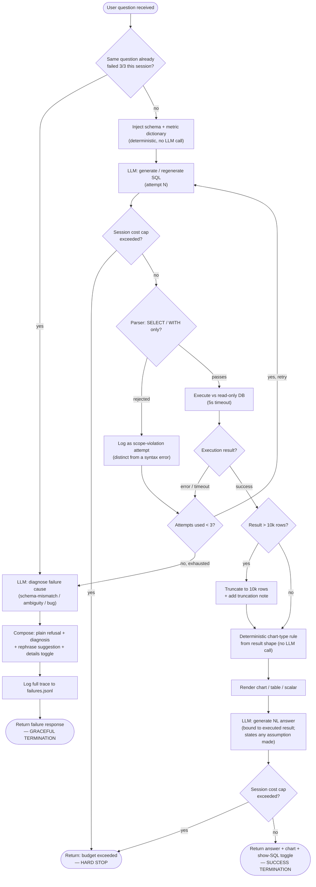

# Control-Flow Architecture — v1

Companion to `scope.md` and `autonomy.md`. Where those two say *what* the agent does and *how much room* each action gets, this doc decides *how the pieces are wired together* — the actual control-flow pattern the running system uses.

## Candidates considered

**A — Fixed deterministic pipeline (prompt chaining / workflow).** A hardcoded sequence of stages — interpret → generate SQL → execute (with a bounded retry sub-loop) → shape result → wrap in language → render. The LLM does the "thinking" inside each stage; the *order* of stages is decided by application code, never by the model.

**B — Bounded tool-use agentic loop.** The model has a small, fixed tool set and decides, turn by turn within a hard step cap, which tool to call and when. This is a standard function-calling agent, deliberately narrowed rather than open-ended.

**C — Open-ended planner / ReAct agent.** The model plans and acts across a large, loosely-bounded step budget — exploring the schema, issuing multiple queries, revising its own plan mid-flight. The natural fit for hypothesis-driven diagnostic reasoning.

**D — Multi-agent (rejected, not shortlisted).** Separate agent contexts (e.g. a "SQL agent," a "narrative agent," a "chart agent") coordinated by an orchestrator. Addressed below rather than scored in the table, per the rule this analysis was given: multi-agent is only justified when separate agents have genuinely different objectives, permissions, or context requirements.

## Comparison

| Criterion | A — Fixed pipeline | B — Bounded tool-use loop | C — Open planner / ReAct |
|---|---|---|---|
| Decisions required per turn | ~2 (retry? — chart type is rule-based, not a decision) | ~3–5 (SQL content, retry vs. give up, minor tool timing) | Unbounded — model-driven at every step |
| Predictability | High — identical stage sequence every run | Medium-high — bounded step cap keeps the worst case small and known | Low — step count and behavior vary run to run |
| Need for dynamic tool selection | Low — the sequence is fixed by code regardless of the question | Moderate — genuinely needed for NL→SQL and self-correction on error | High — needed for hypothesis-driven exploration |
| Need for retries | Yes — hardcoded sub-loop, capped at 3 | Yes — same cap, but retry-vs-stop is a model-visible decision each time | Yes, but "retry" is hard to distinguish from general exploration |
| Need for human approval | None — every action in v1 sits at L2/L3 per the autonomy doc | None for v1's scope — all L2/L3/L1-executed | Likely yes for causal claims — the autonomy doc's Phase-2 flag puts diagnostic conclusions at L1 (propose, don't commit) |
| Long-running state | None needed; hardest pattern to extend with conversational memory later | None needed for v1; naturally holds the Phase-2 `context` seam already specced | Needed almost immediately once exploration spans multiple steps |
| Parallelisable work | None in v1 | None in v1 | Real payoff later — parallel hypothesis checks in Phase 2 |
| Auditability | Highest — every artifact maps to a fixed, named stage | High — full tool-call transcript, though *why* a tool was skipped is less legible | Lower — long, variable-length traces resist exhaustive review |
| Failure containment | Excellent — a failure is isolated to one stage | Good — the hard step cap contains worst-case cost and time | Weak relative to v1's risk tolerance — the exact reason the autonomy doc keeps `run_sql` at L2, not L3 |
| Evaluation difficulty | Easiest — deterministic and directly reproducible against the gold set | Moderate — still gradable on final result, but trace variance adds noise unrelated to SQL quality | Hardest — variable traces resist repeatable grading; why diagnostic eval was scoped out of v1 entirely |
| Implementation complexity | Lowest | Moderate — a standard tool-calling loop, well supported by current LLM SDKs | Highest — needs planning/state infrastructure and tighter guardrails |
| MVP development time | Fastest, ~2 days | Close second, ~2.5 days — matches the "Agent loop" line in `scope.md`'s build sequence almost exactly | Would consume the entire 9–11 day v1 budget on its own |

## Why not multi-agent (D)

The rule this analysis was given: only split into separate agents when they have genuinely different objectives, permissions, or context. None of the three capabilities in v1 clear that bar — `run_sql`, the chart rendering, and the narrative wrap all serve one objective (answer this one question correctly), all sit at the same permission tier (L2, read-only, same guardrails per `autonomy.md`), and all operate on the same context (the same question, schema, and result set). Splitting them into separate agent contexts would add coordination overhead, extra LLM calls, and more surface area for exactly the kind of "who said what" failure modes `autonomy.md`'s escalation section is designed to catch — with no corresponding benefit. It fails every criterion that would justify it: worse auditability (now two logs to reconcile instead of one), higher implementation complexity, longer MVP time, for zero gain on any of the other ten criteria.

The one thing that *would* justify it later: a genuine permission boundary, e.g. a separate "data steward" process with write access to maintain or refresh the views, kept apart from the read-only "analyst" that answers questions. That's a real objective/permission split — but it's speculative, not in v1's scope, and not what's being asked for here. Note separately: Phase-2 diagnostic work parallelising several hypothesis checks is **parallelism**, not multi-agent — same worker, same objective, same permissions, run several times concurrently. Don't let that get relabeled as "multi-agent" later; it isn't.

## Recommendation

### MVP pattern: B, deliberately narrowed

Not every capability in `scope.md`'s tool surface needs to be a *model-decided* tool call. Refining the mechanics (not the capabilities) tightens B considerably:

- **`run_sql` stays a genuine, dynamically-invoked, retried tool.** This is the one place dynamic reasoning is unavoidable and valuable — NL→SQL translation and error-driven self-correction can't be hardcoded. Capped at 3 attempts per `scope.md`.
- **`list_metrics` is *not* a runtime tool call in the final design.** The full metric dictionary is nine short entries — cheap enough to always include directly in context rather than hoping the model remembers to look it up. This removes a whole decision point for near-zero cost, without losing any capability: the agent still knows every metric, it just never has to decide to ask.
- **`plot_chart`'s chart-*type* decision is deterministic, not a model judgment call.** A simple rule on the result's shape (1×1 → scalar; time-indexed → line; categorical breakdown → bar; wide/many-row → table) replaces model discretion here. This is a strictly better engineering choice, not just a simplification: chart-type-from-shape is a solved problem, and removing it from the model's discretion also removes the least-evaluable decision in the system (Layer 4 in `scope.md`, already flagged there as weak-eval). The rendering call itself remains a deterministic code call.
- **The narrative wrap is not a tool at all** — it's the model's constrained final text turn, bound by the autonomy doc's hard rule (never state a number or trend absent from the executed result) and required to disclose any default assumption made ("assume, state, invite override").

Net effect: the model gets genuine agency exactly once per turn — deciding and, if needed, repairing the SQL — and every other step is deterministic. This keeps B's flexibility where it earns its complexity and A's predictability everywhere else, without the coordination cost of a separate pattern.

### Pattern that might be justified later: C — open planner / ReAct

For Phase-2 diagnostic ("why") reasoning, specifically. Hypothesis generation and verification is a genuine multi-step, dynamically-directed exploration problem — the kind B is deliberately too narrow for, and the kind `scope.md`'s Phase-2 backlog and `autonomy.md`'s Phase-2 flag already anticipated.

### Evidence needed before migrating

1. **v1's accuracy floors are met and stable** (75% / 55% / 40% per bucket, per `scope.md`'s definition of done). Don't add planning complexity on top of an unproven descriptive baseline.
2. **Demand signal.** `failures.jsonl` (or the "one real user" Phase-2 backlog item) shows a meaningful, recurring share of questions being narrowed away from diagnostic intent — i.e. real evidence of unmet demand, not a hunch.
3. **A working two-level diagnostic eval exists first.** Given C's evaluation difficulty is the hardest of the three, don't migrate until "did the sub-queries surface the right facts" (objective) and "was the narrative explanation sound" (LLM-judged) can both be measured — otherwise there's no way to tell if the new pattern is actually better.
4. **Cost and latency budgets are deliberately re-opened, not silently exceeded.** An open planner uses meaningfully more calls and tokens per turn than v1's targets (median <8s, budget cap) assume; loosening those is a decision to make explicitly, not a side effect to discover in production.
5. **The L1 "propose, don't commit" disclosure UX is designed**, not just tiered on paper. `autonomy.md` already sets diagnostic conclusions to L1 — but that tier needs a concrete surface (e.g. "possible explanations, unverified: …") before the pattern can ship, not just a policy decision in the abstract.

## Workflow diagram

## Transitions, described in full

**Entry.** A question arrives and is checked against session memory for one thing only (this is the one piece of state v1 tracks, short of full conversational memory): has this *exact* question already exhausted all 3 attempts earlier in this session? If yes, skip straight to diagnosis — repeating a cycle already shown not to work wastes cost and latency for no chance of a different outcome (this is the autonomy doc's escalation rule: repeated identical failures demote retry from L2 to effectively L1). If no, proceed to context assembly.

**Context assembly.** The schema summary and the full metric dictionary are injected into the prompt deterministically — no LLM call, no decision. This is the first of the three refinements from the Recommendation section above: `list_metrics` never has to be "remembered" as a tool call because it's always present.

**SQL generation and the retry loop.** The model generates SQL. Immediately after every such call, the session cost cap is checked — this happens on *every* attempt, not once per turn, since each retry is its own LLM spend. If the cap is exceeded, the turn ends immediately with a distinct budget message, regardless of how many attempts have been used. If the budget holds, the generated SQL passes through the parser: anything other than `SELECT`/`WITH` is rejected before execution is even attempted, and logged as a *scope-violation* attempt (distinct from an ordinary syntax error, per the autonomy doc's escalation note — this is a different failure signature worth telling apart in the log). A rejected query and an executed-but-erroring query both count toward the same 3-attempt budget and both feed their error back to the model for the next attempt. A query that times out (>5s) is treated identically to a runtime error for retry-counting purposes, though the model is told specifically that it timed out (not what was slow) so it restructures rather than reissuing the same query.

**Exhausting the retry budget.** On the third failed attempt (or on arrival via the fast-fail shortcut), the loop exits and a dedicated LLM call classifies *why* — schema mismatch, ambiguity, or a genuine bug — using the full trace of attempts and errors. That diagnosis is composed into the five-part failure response from `scope.md` (plain refusal, diagnosis, concrete rephrase suggestion, technical details on toggle) and the entire trace is logged to `failures.jsonl` before the turn ends.

**Successful execution.** A successful query result first passes a row-cap check: over 10,000 rows, it's truncated with a note — this is a success-path variant, not a failure, and doesn't touch the attempt counter. Either way, control reaches a deterministic chart-type rule keyed on the result's shape (the second refinement: no model judgment spent on this). The chart or table is rendered, and a final LLM call wraps the result in a short natural-language answer, constrained to state nothing beyond what the executed result actually shows, and required to name any default assumption it made (e.g. ranking by revenue when the question didn't specify). That call is cost-checked exactly like the SQL-generation calls; if the cap is hit here, the same hard budget stop applies even though the query itself already succeeded.

## Termination conditions

1. **Success termination.** The query executed (first attempt or within the 3-attempt budget), the result was rendered, and the narrative wrap completed within the session's cost budget. The only termination that returns a positive answer.
2. **Graceful-failure termination.** The 3-attempt budget was exhausted (or the fast-fail shortcut triggered because this exact question already failed earlier this session) without a successful execution. Returns the five-part failure response and logs the full trace. Not an error state from the user's point of view — a deliberately designed non-answer.
3. **Budget termination.** The session's dollar cost cap was exceeded at either checkpoint (after a SQL-generation attempt, or after the narrative wrap). This is the one termination that is not the agent's decision at all — it's the system-level kill switch from `autonomy.md` overriding the loop regardless of where it was interrupted, and it returns a message distinct from the graceful-failure one so the founder understands *why* — budget, not "couldn't answer."

## Failure paths

1. **Parser rejection** — the model produced non-SELECT/WITH SQL. Logged distinctly as a scope-violation attempt, counted toward the 3-attempt budget, error fed back for the next attempt.
2. **SQL runtime/syntax error** — the database rejected the query. Counted toward the 3-attempt budget, error text fed back verbatim so the next attempt can address the specific problem.
3. **Query timeout** — execution exceeded 5 seconds. Counted toward the 3-attempt budget identically to a runtime error; the model is told it timed out, not what was slow, so it restructures the query rather than reissuing it unchanged.
4. **Row-cap overflow** — not a failure. Success path with truncation and a note; does not touch the attempt counter.
5. **Repeated cross-turn failure** — the fast-fail shortcut. The same question already failed 3/3 earlier in this session; skips directly to diagnosis rather than repeating a doomed cycle.
6. **Cost-cap exceeded mid-turn** — a hard stop distinct from all of the above, since it can interrupt a turn that would otherwise have succeeded. Returns a budget-specific message.
