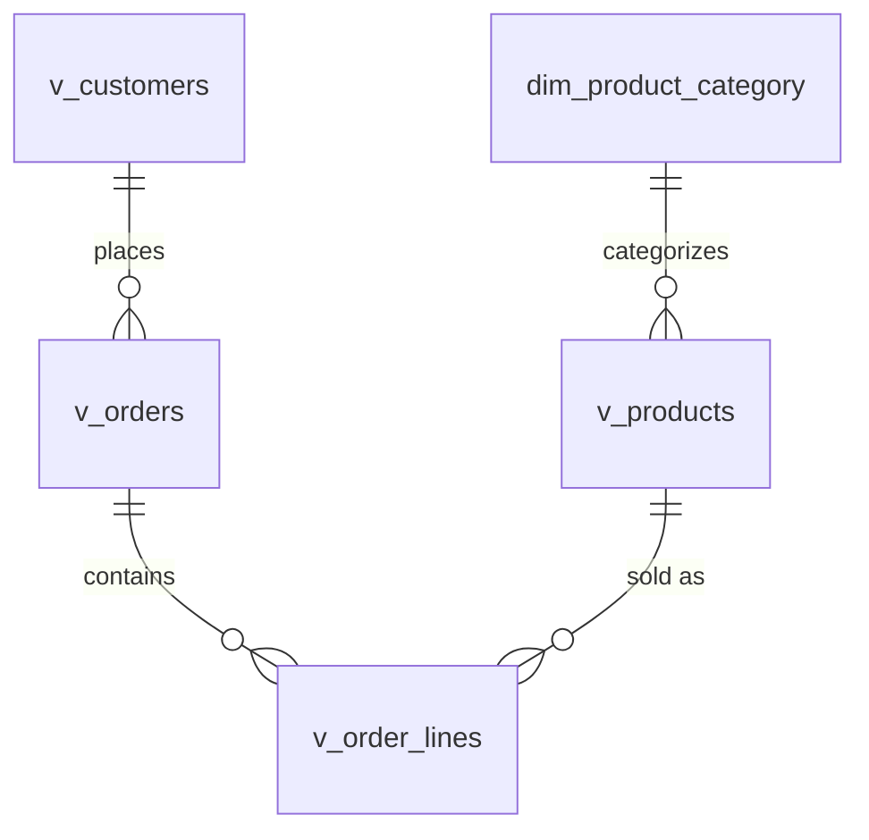
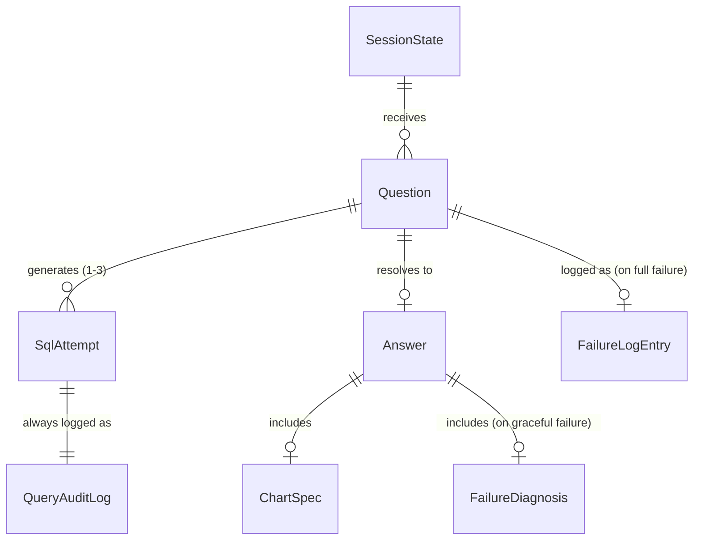
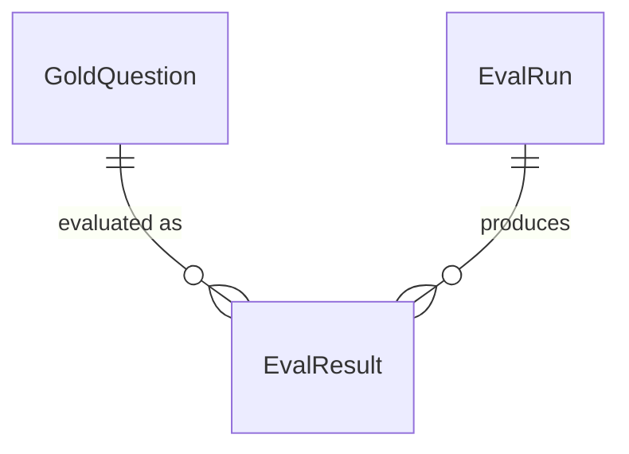

# Information Model — v1

Companion to `scope.md`, `AUTONOMY.md`, `ARCHITECTURE.md`, and `Tools.md`. Those docs named things — the views, the metric dictionary, `failures.jsonl`, the gold set — without ever pinning down their exact shape. This doc is that pinning-down: every distinct kind of information the system creates, stores, or passes around, with its fields, its lifetime, and how it relates to everything else.

## Three layers, not one schema

A single ER diagram covering "the data" would blur three genuinely different things together: data about the founder's *business* (persistent, lives in the database), data about what the *application itself* did (ephemeral or durable, but about behavior, not commerce), and data about *how well the system works* (offline, build-time, never touched at runtime). Each gets its own diagram below because mixing them — say, drawing an edge from `v_orders` to `EvalResult` — would misdescribe the system as much as calling `run_sql` a tool misdescribed `list_metrics` in `Tools.md`.

1. **Domain data** — persistent, in DuckDB. The semantic layer and the metric dictionary.
2. **Operational data** — the application's bookkeeping about its own behavior. Split further by lifetime: session-scoped, turn-scoped, and durable (logged to disk).
3. **Evaluation data** — offline, versioned in git alongside the code, never read or written at runtime.

---

## Layer 1 — Domain data (persistent, in DuckDB)

### The star schema



`v_daily_revenue` is deliberately left off this diagram — it's a date-grain rollup *of* `v_orders`, not an independently related entity, and drawing it as one more box with FK edges would imply a row-level relationship that doesn't exist.

**`v_customers`** — one row per customer.
- `customer_id: string` (PK)
- `country: string`
- `first_order_date: date`
- `last_order_date: date`
- `order_count: integer`
- `lifetime_revenue: decimal`

**`v_orders`** — one row per invoice.
- `order_id: string` (PK)
- `customer_id: string` (FK → `v_customers`, **nullable** — ~25% of raw rows have no CustomerID per `scope.md`'s cleaning rules; these orders count toward revenue totals but are excluded from customer-level metrics)
- `country: string`
- `order_date: date`
- `gross_revenue: decimal`
- `returned_amount: decimal`
- `net_revenue: decimal` — `gross_revenue - returned_amount`
- `item_count: integer`

**`v_order_lines`** — one row per invoice line.
- `line_id: string` (PK)
- `order_id: string` (FK → `v_orders`)
- `product_id: string` (FK → `v_products`) — the StockCode
- `category: string` (denormalized from `dim_product_category` for query convenience)
- `quantity: integer`
- `unit_price: decimal`
- `line_revenue: decimal`
- `is_return: boolean` — true for negative-quantity, `C`-prefixed StockCode rows

**`v_products`** — one row per product.
- `product_id: string` (PK) — StockCode
- `description: string`
- `category: string` (FK → `dim_product_category`)
- `total_units_sold: integer`
- `total_revenue: decimal`
- `distinct_customer_count: integer`
- `top_region: string`

**`dim_product_category`** — the offline LLM-classification lookup from `scope.md`'s cleaning rules.
- `product_id: string` (PK/FK → `v_products`)
- `description: string`
- `category: string`

**`v_daily_revenue`** — date-grain rollup, not part of the relational graph above.
- `date: date` (PK)
- `gross_revenue: decimal`
- `net_revenue: decimal`
- `order_count: integer`
- `unique_customers: integer`

### Metric dictionary (reference data, not row-level)

Named in prose in `scope.md`, always injected into context per `Tools.md`'s Bucket 3 — but never actually specified as data. It is data: nine rows with a consistent shape, seedable at build time.

**Schema:**
- `metric_id: string` (PK)
- `display_name: string`
- `definition: string` — the founder-facing one-line meaning
- `sql_fragment: string` — the conceptual computation, not literal executable SQL
- `unit: enum {currency, count, percentage, rank}`
- `default_direction: enum {asc, desc}` — which direction is "better" for this metric, used for the tie-breaking convention in `scope.md`'s eval design

**The nine rows:**

| metric_id | display_name | sql_fragment | unit | default_direction |
|---|---|---|---|---|
| `revenue` | Revenue | `SUM(net_line_revenue)` | currency | desc |
| `aov` | Average Order Value | `SUM(net_revenue) / COUNT(DISTINCT order_id)` | currency | desc |
| `order_count` | Order Count | `COUNT(DISTINCT order_id)` | count | desc |
| `units_sold` | Units Sold | `SUM(net_quantity)` | count | desc |
| `repeat_rate` | Repeat Customer Rate | `COUNT(customers, order_count>=2) / COUNT(DISTINCT customer_id)` | percentage | desc |
| `return_rate` | Return Rate | `SUM(returned_amount) / SUM(gross_revenue)` | percentage | **asc** |
| `top_selling` | Top / Worst Selling | `ORDER BY <metric> DESC` (worst: `ASC`) | rank | desc |
| `growth_rate` | Growth Rate | `(current_period - prior_period) / prior_period` | percentage | desc |
| `clv` | Customer Lifetime Value | `SUM(net_revenue) GROUP BY customer_id` | currency | desc |

`return_rate` is the one row where `default_direction` is `asc` — lower is better. This is exactly why direction is a per-metric field rather than a system-wide constant: a single global "always rank descending" rule would silently rank the *worst*-performing products as the *top* return-rate offenders when a founder asks for their "best" regions by return rate.

---

## Layer 2 — Operational data (the application's own bookkeeping)

### Session-scoped (in-memory, lost on restart — the one piece of state v1 keeps at all)

**`SessionState`**
- `session_id: string` (PK)
- `started_at: timestamp`
- `cost_spent_usd: decimal`
- `cost_cap_usd: decimal` — default `0.50` per `scope.md`
- `turn_ids: array<string>`
- `failed_questions_cache: map<normalized_question_text, attempt_count>`

The cache key is the **normalized** question text (lowercased, whitespace-collapsed) — an exact-ish match, not a semantic one. This is a deliberate v1 scoping decision left implicit in `ARCHITECTURE.md`'s "same question already failed 3/3?" check: semantic matching would need an embedding lookup, which is real added complexity for a fast-fail path whose only job is avoiding an obviously-repeated question. Worth stating outright rather than leaving the matching logic to be discovered later as a bug.

### Turn-scoped (exist only for the duration of one question's pipeline run)

**`Question`**
- `turn_id: string` (PK)
- `session_id: string` (FK → `SessionState`)
- `raw_text: string`
- `received_at: timestamp`

**`SqlAttempt`** — matches `run_sql`'s I/O contract from `Tools.md`, combined into one record.
- `turn_id: string` (FK → `Question`)
- `attempt_number: integer` (1–3)
- `query_text: string`
- `status: enum {success, error, timeout, rejected}`
- `error_message: string, nullable`
- `execution_ms: integer`
- `row_count: integer, nullable`
- `truncated: boolean`

**`ChartSpec`**
- `chart_type: enum {scalar, line, bar, table}`
- `data: reference to the winning SqlAttempt's rows`
- `x_axis, y_axis: string, nullable` — set only for `line`/`bar`

**`FailureDiagnosis`** — the output of `Tools.md`'s failure-diagnosis completion.
- `category: enum {schema_mismatch, ambiguity, bug}`
- `explanation: string`
- `rephrase_suggestion: string`

**`Answer`** — the object the Streamlit layer renders directly.
```json
{
  "turn_id": "string",
  "status": "success | graceful_failure | budget_stop",
  "answer_text": "string | null",
  "assumption_disclosed": "string | null",
  "chart_spec": "ChartSpec | null",
  "sql_shown": "string | null",
  "diagnosis": "FailureDiagnosis | null"
}
```
`answer_text`, `chart_spec`, and `sql_shown` are populated only when `status == "success"`; `diagnosis` only when `status == "graceful_failure"`. A `budget_stop` `Answer` carries none of the optional fields — just the status, which the UI maps to its own fixed message.

### Durable (written to disk, survive the session)

**`QueryAuditLog`** — one entry per `SqlAttempt`, written **regardless of outcome**. This is the complete raw material behind the eval harness's attempts-until-success metric, across every turn, successful or not — not just the failed ones.
- `turn_id, session_id, attempt_number, query_text, status, execution_ms, row_count, error_message, logged_at`

**`FailureLogEntry`** (`failures.jsonl`) — written only when a turn fully fails: 3 attempts exhausted, or the fast-fail cache short-circuited it. A curated subset of `QueryAuditLog`, not a duplicate of it.
```json
{
  "turn_id": "string",
  "session_id": "string",
  "question_text": "string",
  "attempts": ["SqlAttempt", "..."],
  "diagnosis": "FailureDiagnosis",
  "fast_fail_triggered": "boolean",
  "logged_at": "timestamp"
}
```



---

## Layer 3 — Evaluation data (offline, build-time, versioned in git — never touched at runtime)

**`GoldQuestion`** (`gold.jsonl`) — the 60 hand-crafted triples from `scope.md`.
- `question_id: string` (PK)
- `question_text: string`
- `bucket: enum {basic, semantic, adversarial}`
- `gold_sql: string`
- `gold_result: {columns, rows}`
- `is_graceful_failure_case: boolean` — meaningful only within `adversarial`; true for the ~5–10 questions designed to fail on purpose

**`EvalRun`** — one per harness execution.
- `run_id: string` (PK)
- `git_commit_hash: string`
- `prompt_hash: string`
- `timestamp: timestamp`
- `per_bucket_accuracy: map<bucket, float>`
- `attempts_until_success_distribution: map<attempt_count, count>`
- `graceful_failure_rate: float`

**`EvalResult`** — one per gold question per run.
- `run_id: string` (FK → `EvalRun`)
- `question_id: string` (FK → `GoldQuestion`)
- `passed: boolean`
- `agent_sql: string`
- `agent_result: {columns, rows}, nullable`
- `diff: string, nullable`
- `attempts_used: integer`



---

## Cross-layer notes

**Why `QueryAuditLog` and `FailureLogEntry` are two entities, not one.** `QueryAuditLog` is unconditional — every attempt, success or failure, because it's the source data for a metric (attempts-until-success) that needs the successful turns too, not just the failed ones. `FailureLogEntry` is conditional and richer — it exists specifically to drive the graceful-failure UX and future gold-set expansion, so it bundles the whole attempt array with the diagnosis, rather than being read back out of scattered `QueryAuditLog` rows after the fact.

**Why the metric dictionary belongs in Layer 1, not Layer 2.** It's read-only reference data about the founder's business domain (what "AOV" means for *this* dataset), not bookkeeping about the application's own behavior — even though, mechanically, it's injected into a prompt rather than joined in a query.

**Where `SessionState` sits relative to `scope.md`'s "single-turn stateless" design.** Stateless refers to conversational memory — no turn remembers the *content* of a prior turn. `SessionState` is a narrower, deliberately-scoped exception that exists purely to make the cost cap and the fast-fail check work; it is not the seam `ARCHITECTURE.md` reserved for Phase-2 multi-turn context, and shouldn't be expanded to become that seam by accident.
